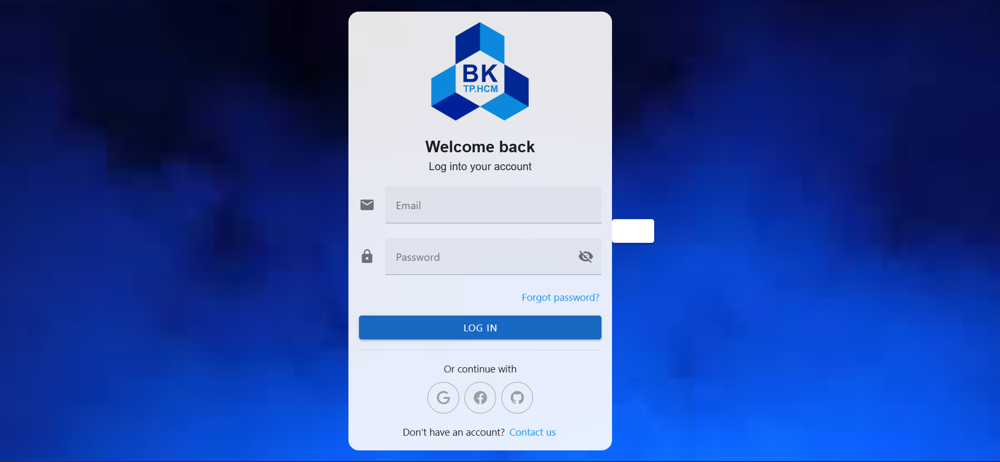
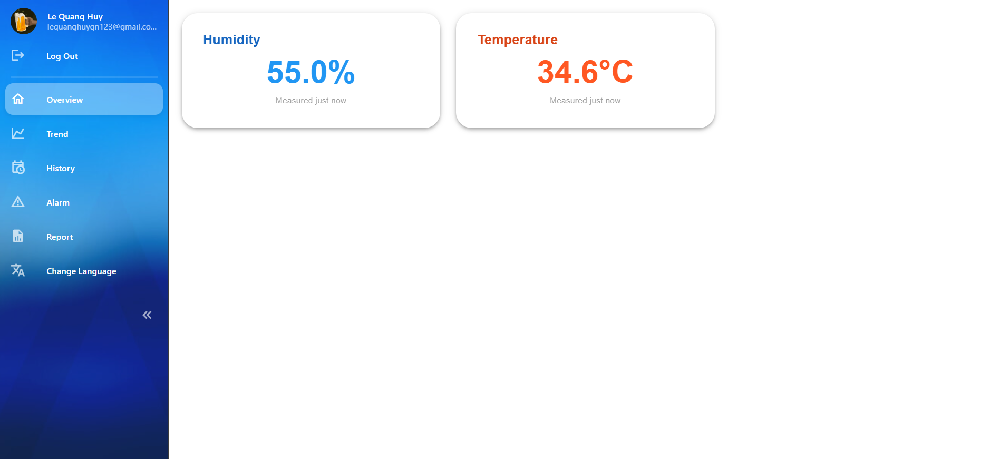

# iiot-vue-web-app

A modern, responsive, secured web dashboard built with **Vue.js**  

Part of my self-learning project, along with [Vue Web App](https://github.com/huyle-auto/iiot-vue-web-app) and [API Server](https://github.com/huyle-auto/iiot-api-server). See full [project architecture](https://github.com/huyle-auto/iiot-micro-service-mqtt-client/blob/7a92edc33feab2fa177edbdcb55190a52904683b/architecture.jpg)

## Use Case

This desktop-based web application visualizes **real-time status** and **historical sensor data** in a user-friendly format.

## Screenshots

| Login form | Dashboard |
|-----------|------------------|
|  |  |

## Tech Stack

- **Vue 3**
- **Vuetify 3** 
- **Vue Router**
- **Vite** 
- **i18n**

## Features
- Only communicate via https requests to [API Server](https://github.com/huyle-auto/iiot-api-server)
- Authentication using email + bcrypt password
- Authorization via **JWT** in **HttpOnly Cookies**
- Multi-language support (i18n)
- Sensor data visualization (charts, tables)
- Page routing & navigation

## Live demo
**Web App:** [https://salmon-field-08f48e900.6.azurestaticapps.net](https://salmon-field-08f48e900.6.azurestaticapps.net)  
> Always use the exact link above to avoid **404 Not Found** errors.

## Run Locally

```bash
npm install
npm run dev
```

> **Please note that this web app is still under development and UX quality is relative low. Live sensor data update on website is only available if my ESP32 is powered on. Thank you for your understanding!**


